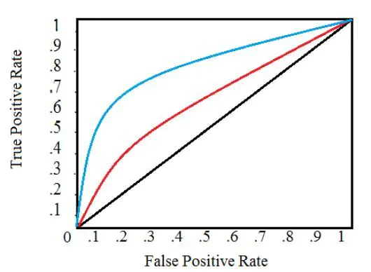
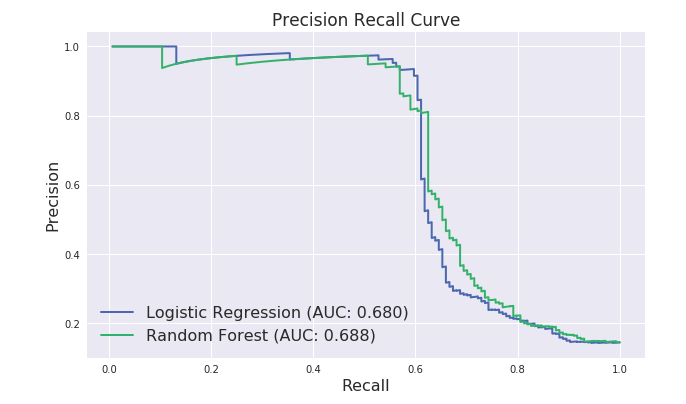
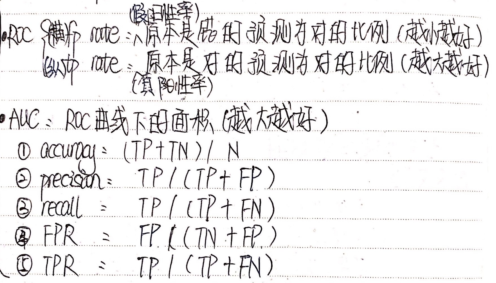
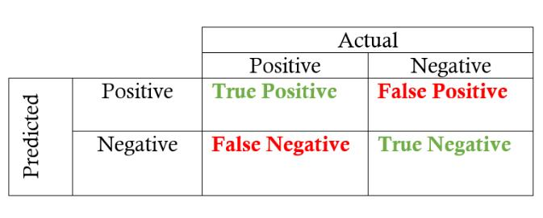

1. ROC曲线 
   
   - **ROC曲线展示了当改变在模型中识别为正例的阈值时，真阳率和假阳率的关系会如何变化**。**当阈值降低时，识别正例增多，同时误判正实例增多，即TPR和FPR会同时增大**。阈值最大时，对应坐标点为(0,0)，阈值最小时，对应坐标点(1,1)。ROC 曲线在 Y 轴上画出了真正例率（TPR），在 X 轴上画出了假正例率 (FPR)。  
   
   - 在阈值为 1.0 的情况下，我们将位于图的左下方，因为没有将任何数据点识别为正例，这导致没有真正例，也没有假正例（TPR = FPR = 0）。  
   - 当降低阈值时，我们将更多的数据点识别为正例，导致更多的真正例，但也有更多的假正例 ( TPR 和 FPR 增加)。  
   - 最终，在阈值 0.0 处，我们将所有数据点识别为正，并发现位于 ROC 曲线的右上角 ( TPR = FPR = 1.0 )。

  

2. PR曲线
   
   -  在PR曲线中，以Recall为x轴，Precision为y轴。
   -  与ROC曲线左上凸不同的是，PR曲线是右上凸效果越好。

   

   -  **ROC vs. PR**  
      
      - 当正负样本差距不大的情况下，ROC和PR的趋势是差不多的。但是当负样本很多的时候，两者就截然不同了，ROC效果依然看似很好，但是PR上反映效果一般。
  
      - ROC曲线的优点是不会随着类别分布的改变而改变，但这在某种程度上也是其缺点。因为负例N增加了很多，而曲线却没变，这等于产生了大量FP。像信息检索中如果主要关心正例的预测准确性的话，这就不可接受了。
      - ROC曲线由于兼顾正例与负例，所以适用于评估分类器的整体性能，相比而言PR曲线完全聚焦于正例。
      - 如果有多份数据且存在**不同**的类别分布，比如信用卡欺诈问题中每个月正例和负例的比例可能都不相同，这时候如果只想单纯地比较分类器的性能且剔除类别分布改变的影响，则**ROC曲线**比较适合，因为类别分布改变可能使得PR曲线发生变化时好时坏，这种时候难以进行模型比较；反之，如果想测试不同类别分布下对分类器的性能的影响，则PR曲线比较适合。
      - 如果想要评估在**相同**的类别分布下正例的预测情况，则宜选**PR曲线**。
      - 类别不平衡问题中，ROC曲线通常会给出一个乐观的效果估计，所以大部分时候还是PR曲线更好。

3. AUC
   - 我们可以通过计算曲线下面积 ( AUC ) 来量化模型的 ROC 曲线，这是一个介于 0 和 1 之间的度量，面积越大，表示分类性能越好，意味着模型在实现准确度和召回率的权衡方面更好。
   - 多个模型的性能相近时，相应的ROC曲线会出现交叉，性能较难对比。此时，可以通过AUC量化的取值进行判断。

4. 常用评价指标
   - $F1=\frac2{\frac1{precision}+\frac1{recall}}$
   
     
5. 混淆矩阵
    

6. ROC vs. F1  
   $$
   \begin{aligned}
      Precision&=P(Y=1|\hat{y}=1) \\
      TPR=Recall&=P(\hat{y}=1|Y=1) \\
      FPR&=P(\hat{y}=1|Y=0)
   \end{aligned}
   $$

   
   - TPR 和 FPR 是条件于真实label Y的概率的。我们讲这个叫条件概率嘛。那么意思就是说，**无论 Y 的真实概率是多少，都不会影响 TPR 和 FPR**。也就是说，这两个 metric 是不会受 imbalanced data 影响的。**而 precision 会随着测试集里面的正反比例而变化**。
   
   - ROC curve 可以很好的回答什么问题呢——“不论class的基本概率怎么样，我的模型in general能表现得多好？”
   - 一般来说呢，最优的threshold就是橙色曲线离蓝色虚线（基准线）最远的一点啦，或者橙色曲线上离左上角最近的一点，再或者是根据用户自己定义的cost function来的。
  
> reference  
  [1] [牢记分类指标：准确率、精确率、召回率、F1 score以及ROC|简书-MiracleJQ](https://www.jianshu.com/p/1afbda3a04ab)  
  [2] [机器学习之类别不平衡问题 (2) —— ROC和PR曲线|博客园-massquantity](https://www.cnblogs.com/massquantity/p/8592091.html)