## 一、RNN
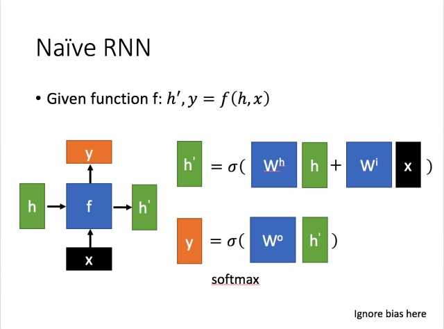
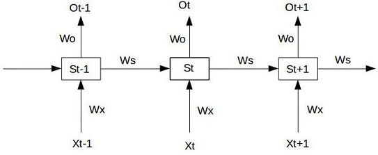
   
- **传统RNN的问题**  

   - 梯度消失和梯度爆炸
   - 长期记忆的部分信息被短期记忆覆盖

- **RNN梯度消失和梯度爆炸** 
    
    梯度不稳定的问题要追溯到Loss函数对参数W的偏导计算过程中。分别看一下上图中的$w_o$、$w_s$、$w_x$，偏导式如下：  
    $$
    \begin{aligned}
        \frac{\partial L_t}{\partial w_x} 
        &= \sum_{i=1}^{t}{\frac{\partial L_t}{\partial o_t}\frac{\partial o_t}{\partial s_t}}(\prod_{j=i+1}^{t}\frac{\partial {s_j}}{\partial s_{j-1}})\frac{\partial s_i}{\partial w_x}\\ 
        &= \sum_{i=1}^{t}{\frac{\partial L_t}{\partial o_t}\frac{\partial o_t}{\partial s_t}}(\prod_{j=i+1}^{t}tanh'·w_x)\frac{\partial s_i}{\partial w_x}\\

        \frac{\partial L_t}{\partial w_x} 
        &= \sum_{i=1}^{t}{\frac{\partial L_t}{\partial o_t}\frac{\partial o_t}{\partial w_o}}
    \end{aligned}
    $$

    - 可以看出，问题源于上式中的$\prod_{j=i+1}^{t}\frac{\partial {s_j}}{\partial s_{j-1}}$，它由$tanh'$和$w_x$两部分的连乘组成。当激活函数的导数值小于1且网络层较深时，连乘结果接近于零，产生梯度消失现象；当参数值较大时，连乘结果较大，产生梯度爆炸现象。

    - 对w_s的偏导结果与对w_x的偏导结果类似。此外，从对w_o的偏导结果中看出o_t只和当前step的w_o相关，所以不会引起梯度爆炸问题。
  
## 二、LSTM
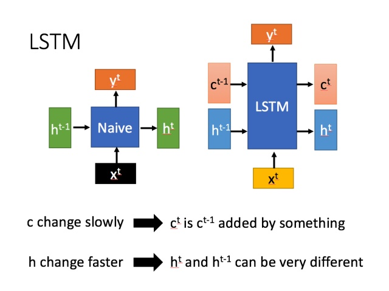
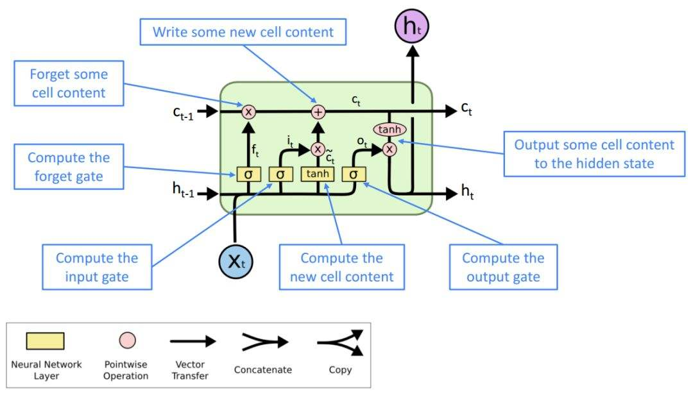
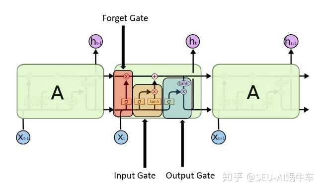
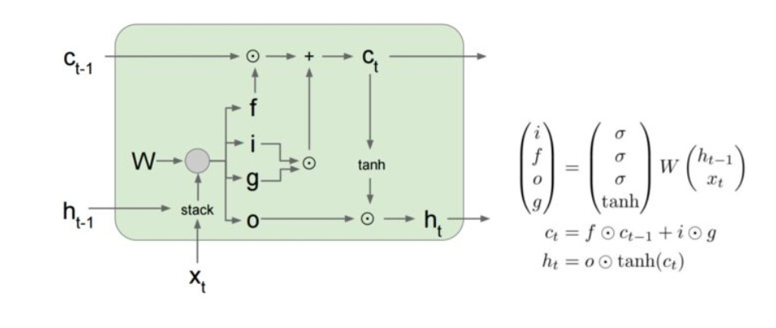
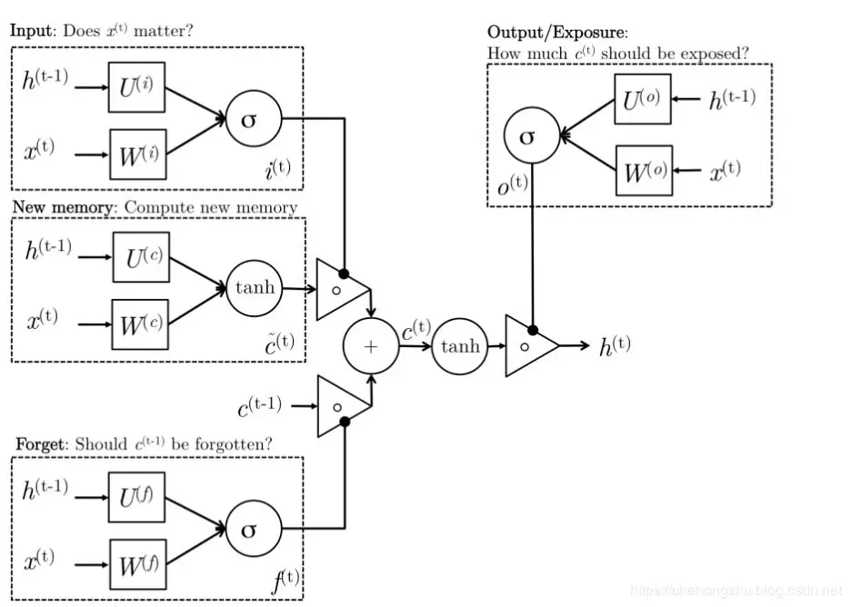

- **LSTM的改变**
  
  相比RNN只有一个传递状态$h_t$，LSTM有两个传输状态，一个$c_t$（cell state），和一个$h_t$（hidden state）。（Tips：RNN中的$h_t$对于LSTM中的$c_t$）其中对于传递下去的$c_t$改变得很慢，通常输出的$c_t$是上一个状态传过来的$c_{t-1}$加上一些数值。而$h_t$则在不同节点下往往会有很大的区别。
  
- **LSTM利用gate缓解梯度消失**  
    
    以$c_t=f_t·c_{t-1}+i_t·g_t$为例，依然重点关注$\frac{\partial c_t}{\partial c_{t-1}}$，可求得：$\frac{\partial c_t}{\partial c_{t-1}}=f_t+\frac{\partial{f_t}}{\partial {c_{t-1}}}·c_{t-1}+\frac{\partial{i_t}}{\partial {c_{t-1}}}·g_t+i_t·\frac{\partial{g_t}}{\partial {c_{t-1}}}$。  

    上式中，第一项是$f_t$，这是一个0~1的小数，控制了对过去信息的保留程度。因此，只要遗忘门的数值接近1，就可以缓解梯度消失问题了。

    这里说缓解，是因为LSTM只是在$c_t$到$c_{t-1}$这条路上解决梯度消失问题，而其他路依然存在梯度消失问题。

- **双向LSTM**   

  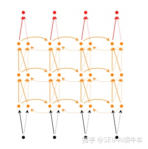
## 三、GRU

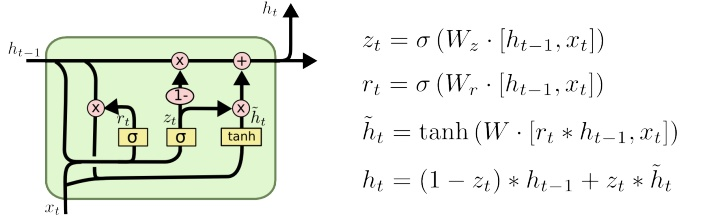
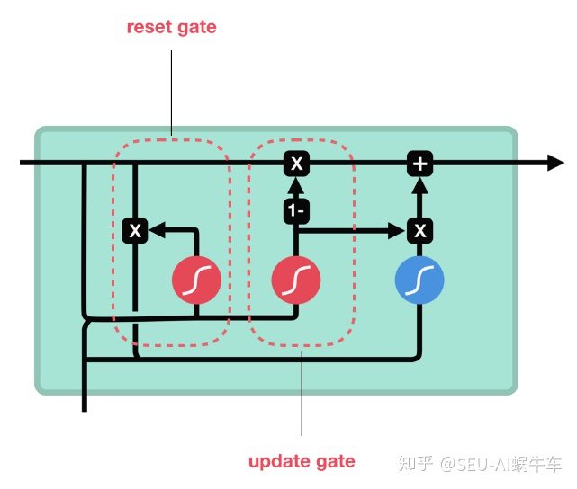
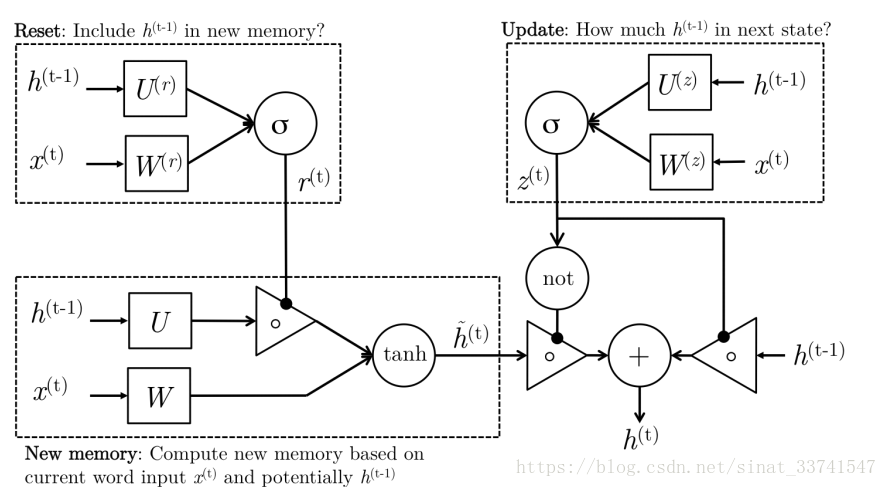
   - **GRU的变化**  

        GRU包含两个门，分别是`reset gate`$r_t$和`update gate`$z_t$。  
        得到门控信号后，首先使用重置门控来记忆当前时刻的状态，其次使用更新门控同时进行遗忘和选择记忆。

        GRU组合了遗忘门和输入门到一个单独的“更新门”中。它也合并了cell state和hidden state，并且做了一些其他的改变。

   - **GRU解决梯度消失**  

        还是求一下$\frac{\partial h_t}{\partial h_{t-1}}$，可以得到：$\frac{\partial h_t}{\partial h_{t-1}}=(1-z_t)+\frac{\partial(1-{z_t})}{\partial {h_{t-1}}}·h_{t-1}+\frac{\partial{z_t}}{\partial {h_{t-1}}}*\widetilde{h}_t+z_t*\frac{\partial{\widetilde{h}_t}}{\partial {h_{t-1}}}$。依然只看第一项，可以得知，通过控制$z_t$即可缓解梯度消失现象。

#### reference：  
  [1][漫谈LSTM系列的梯度问题|知乎-susht](https://zhuanlan.zhihu.com/p/36101196)