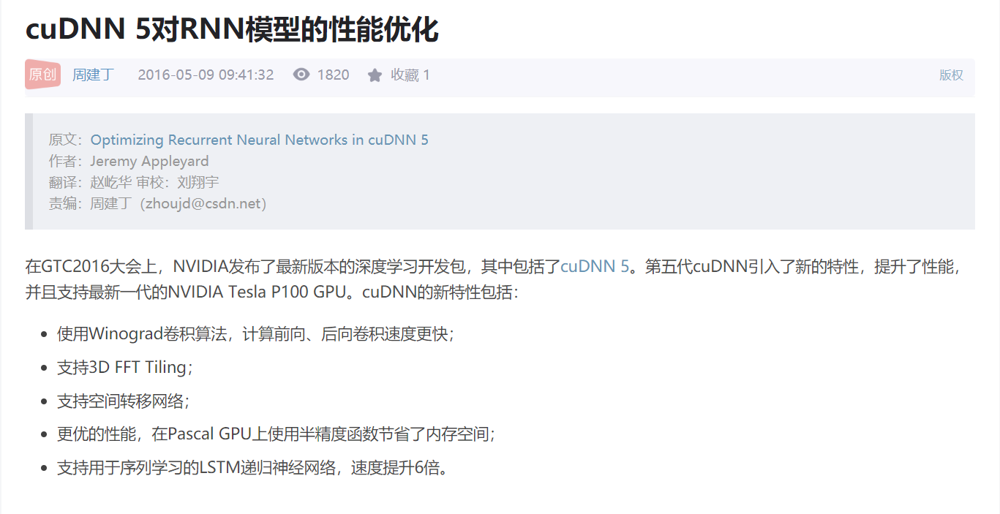
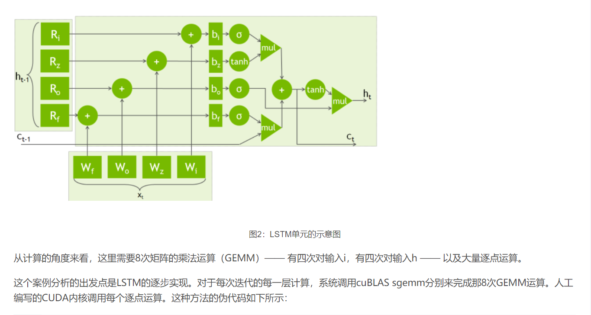

通过查看 Nvidia 的手册，可以知道，其实 CUDNN 内部对于 LSTM 已经有了比较好的实现。

下图是变长数据集上4层双向LSTM实验的效率对比。这里有些LSTM实现没有加入，这是由于接口实现不支持，比如TensorFlow cuDNNLSTM没法处理变长数据。

CuDNNLSTM is faster (it uses the GPU support) but it has less options than LSTM (dropout for example) 
tf.contrib.cudnn_rnn.CudnnLSTM currently does not support batches with sequences of different length, thus this is normally not an option to use.

https://blog.csdn.net/happytofly/article/details/80123099

