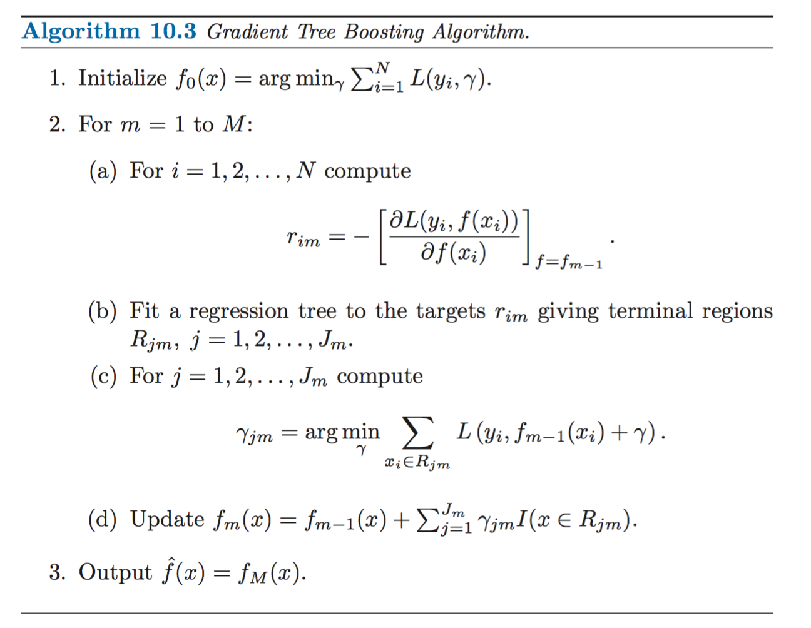

1. bagging  
   选取部分特征；多数投票
2. **boosting**  
   
   boosting方法通过分步迭代（stage-wise）的方式来构建模型，在迭代的每一步构建的弱学习器都是为了弥补已有模型的不足。

   - AdaBoost  

        AdaBoost算法通过给已有模型预测错误的样本更高的权重，使得先前的学习器做错的训练样本在后续受到更多的关注的方式来弥补已有模型的不足。
   - GBDT

        梯度提升方法在迭代的每一步构建一个能够沿着梯度最陡的方向降低损失（steepest-descent）的学习器来弥补已有模型的不足。
    
    - AdaBoost vs. GBDT

        - 经典的AdaBoost算法只能处理采用指数损失函数的二分类学习任务[2]，而梯度提升方法通过设置不同的可微损失函数可以处理各类学习任务（多分类、回归、Ranking等），应用范围大大扩展。
        
        - AdaBoost算法对异常点（outlier）比较敏感，而梯度提升算法通过引入bagging思想、加入正则项等方法能够有效地抵御训练数据中的噪音，具有更好的健壮性。

### 1、Boosting加法模型
gbdt模型可以看成是由k棵决策树组成的加法模型：
$$
\hat{y}_i
 = \sum_{k=1}^Kf_k(x_i), f_k\in{F}
$$
其中F是指所有基模型组成的函数空间。相应地，目标函数可以写为：
$$
Obj=\sum_{i=1}^nl(y_i,\hat{y}_i)+\sum_{k=1}^K\Omega({f_k})
$$
其中$\Omega$代表基模型的复杂度，此处为树的深度、叶子节点数等指标。  

Boosting采用前向优化算法，即以优化逼近目标函数为目的，多次迭代建立新模型，具体过程如下：
$$
\hat{y}_i^t=\sum_{k=1}^tf_k(x_i)=\hat{y}_i^{t-1}+f_t(x_i)
$$
其中，$f_t(x_i)$为第$t$步加入的新模型。相应地，目标函数可以写为：  
$$
\begin{aligned}
    Obj&=\sum_{i=1}^nl(y_i,\hat{y}_i)+\sum_{k=1}^K\Omega({f_k}) \\
       &=\sum_{i=1}^nl(y_i,\hat{y_i}^{t-1}+f_t(x_i))+\Omega({f_t})+constant
\end{aligned}
$$

假设损失函数为平方差损失，则目标函数为：
$$
\begin{aligned}
    Obj&=\sum_{i=1}^n(y_i-(\hat{y_i}^{t-1}+f_t(x_i)))^2+\Omega({f_t})+constant \\
       &=\sum_{i=1}^n[2(\hat{y_i}^{t-1}-y_i)f_t(x_i)+f_t(x_i)^2]+\Omega({f_t})+constant
\end{aligned}
$$
其中，$(\hat{y_i}^{t-1}-y_i)$称为残差（residual）。因此，使用平方损失函数时，GBDT算法的每一步在生成决策树时只需要拟合前面的模型的残差。

### 参考资料
[1] [GBDT算法原理深入解析
](https://www.zybuluo.com/yxd/note/611571)  
[2] [XGBoost 与 Boosted Tree | 陈天奇](https://blog.csdn.net/haoxiaoxiaoyu/article/details/78463312)  
[3] [机器学习-一文理解GBDT的原理-20171001
| 知乎-谋杀电视机
](https://zhuanlan.zhihu.com/p/29765582)  
[4] [GBDT的python源码实现
 | 知乎-RR(DoubleR)
](GBDT的python源码实现
)