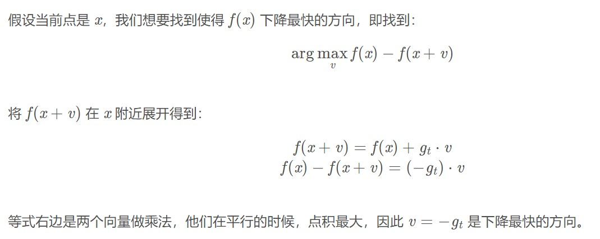
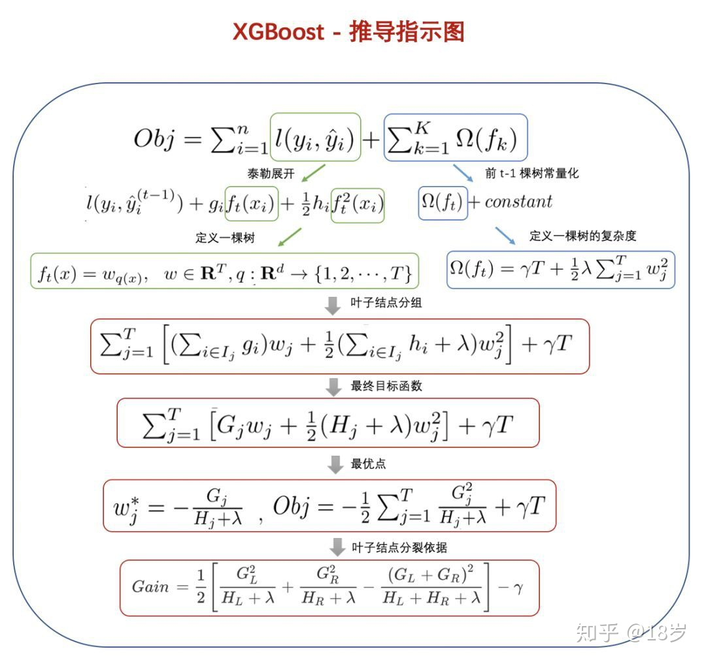

## 机器学习算法
### 逻辑回归
1. 逻辑回归为什么叫“逻辑”回归？
   ```
    “逻辑”回归是一种音译，其实可能翻译为“对数几率回归”更好。
    对数几率函数是一种sigmoid函数，几率反映了x作为正例的相对可能性。
    直接对对数几率做线性回归，几率是呈指数级增长，所以前面加了对数.
    ln(y/(1-y)) = z = wx+b    ==>     y = 1/(1+e^-z)
   ```
2. 逻辑回归的推导
   ```

   ```
3. 逻辑回归和朴素贝叶斯的区别
   ```
    由于逻辑回归和朴素贝叶斯分类器都采用了极大似然法进行参数估计，所以它们会被经常用来对比。
    (另一对经常做对比的是逻辑回归和SVM，因为它们都是通过建立一个超平面来实现分类的)
    
    1.逻辑回归属于判别式模型，而朴素贝叶斯属于生成式模型。具体来说，两者的目标虽然都是最大化后验概率，
    但是逻辑回归是直接对后验概率P(Y|X)进行建模，而朴素贝叶斯是对联合概率P(X,Y)进行建模，所以说两者的出发点是不同的
    2.朴素贝叶斯分类器要求“属性条件独立假设”即，对于已知类别的样本x，假设x的所有特征属性是相互独立的
    (1)朴素贝叶斯的限制条件比逻辑回归更加严格，意味着逻辑回归的应用范围更广。
    (2)朴素贝叶斯可以不通过（而不是不能）梯度下降等优化方法进行参数优化
    3.在小数据上面朴素贝叶斯分类器可以取得更好的效果，随着数据的增多、特征维度的增大，逻辑回归的效果更好
    4.逻辑回归和朴素贝叶斯分类器都是对特征的线性表达，虽然两者拟合的参数不同，前者是W和b后者是先验概率和似然
    5.逻辑回归本质上是对对数几率做线性回归.朴素贝叶斯中的对数线性和Logistic回归中的对数线性作用不同.朴素贝叶斯算这一长串概率相乘的时候，为了避免浮点数下溢加了log。
   ```
4. 逻辑回归和SVM的区别
   ```
    相同点：
    1.都是分类算法，本质上都是在找最佳分类超平面；
    2.都是监督学习算法；
    3.都是判别式模型，判别模型不关心数据是怎么生成的，它只关心数据之间的差别，然后用差别来简单对给定的一个数据进行分类；
    4.都可以增加不同的正则项。
    
    不同点：
    1.LR 是一个统计的方法，SVM 是一个几何的方法；
    2.SVM 的处理方法是只考虑 Support Vectors，也就是和分类最相关的少数点去学习分类器。
    而逻辑回归通过非线性映射减小了离分类平面较远的点的权重，相对提升了与分类最相关的数据点的权重；
    3.损失函数不同：LR 的损失函数是交叉熵，SVM 的损失函数是 HingeLoss，这两个损失函数的目的都是增加对分类影响较大的数据点的权重，减少与分类关系较小的数据点的权重。对 HingeLoss 来说，其零区域对应的正是非支持向量的普通样本，从而所有的普通样本都不参与最终超平面的决定，这是支持向量机最大的优势所在，对训练样本数目的依赖大减少，而且提高了训练效率；
    4.LR 是参数模型，SVM 是非参数模型，参数模型的前提是假设数据服从某一分布，该分布由一些参数确定（比如正太分布由均值和方差确定），在此基础上构建的模型称为参数模型；非参数模型对于总体的分布不做任何假设，只是知道总体是一个随机变量，其分布是存在的（分布中也可能存在参数），但是无法知道其分布的形式，更不知道分布的相关参数，只有在给定一些样本的条件下，能够依据非参数统计的方法进行推断。所以 LR 受数据分布影响，尤其是样本不均衡时影响很大，需要先做平衡，而 SVM 不直接依赖于分布；
    5.LR 可以产生概率，SVM 不能；
    6.LR 不依赖样本之间的距离，SVM 是基于距离的；
    7.LR 相对来说模型更简单好理解，特别是大规模线性分类时并行计算比较方便。而 SVM 的理解和优化相对来说复杂一些，SVM 转化为对偶问题后，分类只需要计算与少数几个支持向量的距离，这个在进行复杂核函数计算时优势很明显，能够大大简化模型和计算。
   ```
5. 逻辑回归和线性回归的本质区别
   ```
   1.值域：[0,1] 无穷多
   2.任务：分类 预测
   3.目标：最大似然估计 最小二乘法
   ```
### 集成学习
1. 随机森林学习过程
   ```
   1.是一种bagging集成学习方法
   2.对两样东西随机：特征和样本
   3.每次选取部分特征和部分样本(有放回抽样)，一定程度避免了过拟合
   4.采用多数投票
   ```

2. RF和GBDT的不同
   ```
   RF不会过拟合 GBDT会过拟合
   RF是放回地随机取样 GBDT是取全量样本
   RF是多数投票 GBDT是线性加权
   RF是减少方差 GBDT是减少偏差
   ```
3. GBDT学习过程
   
   

   ```
   1.一种boosting集成学习方法，是多个基分类器的加法模型。
   2.GBDT在迭代的每一步构建一个能够沿着梯度最陡的方向降低损失的学习器来弥补已有模型的不足，在GBDT中常用CART回归决策树。
   具体来说，每次迭代用前m-1棵树的累加损失函数的负梯度作为目标值去训练当前第m棵树，使得m棵树的累加和逼近真实值。
   3.常说的“拟合残差”，是因为GBDT回归任务常常使用MSE，MSE的一阶导数刚好等于预测值与真实值的差值。
   ```
4. GBDT缺点？
   ```
   基函数之间有串行依赖关系，无法做树维度的并行
   容易过拟合（没有正则，没有特征/样本子采样，只有剪枝）
   ```
5. GBDT防止过拟合的方法？
   ```
   1.控制tree的棵树，即迭代次数M；控制叶子节点中的最少样本个数；控制树的最大深度
   2.降低learning rate
   3.降低子采样比例subsample
   4.在目标函数中加入惩罚树的复杂度(即惩罚叶子节点占比)，用后验剪枝算法去掉降低loss幅度小于某阈值的分支
   ```
6. GBDT预测时每一棵树是否能并行？
    ```
    预测的时候可以并行的。
    训练的时候下一轮的目标值依赖上一轮的结果，需要iteratively fits，不能并行。
    而预测的时候每棵树都已经建好，输入是原始数据，输出是把每棵树的预测值加在一起，预测过程树之间并没有依赖，不存在先算后算的问题，所以可以并行。
   ```
7. GBDT怎么做多分类任务？

   

   ```
   为每个类别构建一棵二分类CART树，即每次迭代同时训练k棵树，使用softmax获取概率
   ```
8. 用泰勒展开解释“为什么负梯度是下降最快的方向？”
   
   
9.  GBDT的主要参数
   ```
   # boosting类参数
   n_estimators 最大学习器的个数，太小欠拟合，太大过拟合
   learning_rate 学习率，太大过拟合，一般很小0.1，和n_estimators一起调
   subsample 子采样，防止过拟合，太小欠拟合。GBDT中是不放回采样
   
   # tree类参数
   max_features 最大特征数
   max_depth 最大树深，太大过拟合
   min_samples_split 内部节点再划分所需最小样本数，越大越防过拟合
   min_weight_fraction_leaf 叶子节点最小的样本权重和，越大越防过拟合
   max_leaf_nodes 最大叶子结点数，太大过拟合
   min_impurity_split 节点划分最小不纯度
   presort 是否对数据进行预分类，以加快最佳分类点的发现。默认False，适用于大数据集；小数据集使用True加快训练。对稀疏数据不管用
   ```
11. GBDT怎么调参？
   ```   
   1、首先使用默认的参数，进行数据拟合；
   2、从步长(learning rate)和迭代次数(n_estimators)入手；一般来说,开始选择一个较小的步长来网格搜索最好的迭代次数。这里，可以将步长初始值设置为0.1。对于迭代次数进行网格搜索；
   3、接下来对决策树的参数进行寻优
   4、首先我们对决策树最大深度max_depth和内部节点再划分所需最小样本数min_samples_split进行网格搜索。【min_samples_split暂时不能一起定下来，因为这个还和决策树其他的参数存在关联】
   5、接着再对内部节点再划分所需最小样本数min_samples_split和叶子节点最少样本数min_samples_leaf一起调参；做到这里，min_samples_split要做两次网格寻优，一次是树的最大深度max_depth，一次是叶子节点最少样本数min_samples_leaf。
   【具体观察min_samples_split的值是否落在边界上，如果是可以进一步寻优】
   6、继续对最大特征数max_features进行网格搜索。做完这一步可以看看寻找出的最优参数组合给出的分类器的效果。
   7、可以进一步考虑对子采样的比例进行网格搜索，得到subsample的寻优参数
   8、回归到第2步调整设定的步长(learning rate)和迭代次数(n_estimators)，注意两者的乘积保持不变，这里可以分析得到：通过减小步长可以提高泛化能力，但是步长设定过小，也会导致拟合效果反而变差，也就是说，步长不能设置的过小。
   ```
11. 关于Shrinkage
      ```
      Shrinkage（缩减）的思想认为，每次走一小步逐渐逼近结果的效果，要比每次迈一大步很快逼近结果的方式更容易避免过拟合。
      在GBDT中同样利用了Shrinkage的思想，通过对初始树除外的每一棵树给予一个较小的学习率，让整个模型换慢迭代逼近结果，以避免过拟合。
      ```
12. XGBoost推导过程
      
      
      ```
      https://zhuanlan.zhihu.com/p/92837676
      ```
13. XGBoost与GBDT有何不同？
      ```
      1.基函数不同 GBDT只用CART树，XGBoost除了CART树，也支持线性函数
      2.目标不同 GBDT根据均方误差(回归)或基尼指数(分类)，XGBoost则进一步引入了正则项
      3.XGBoost对每棵树都进行了正则约束 包含了对叶子结点数的约束，以及叶子输出权值的L2范数
      4.导数阶数不同 XGBoost利用一阶和二阶导数，支持自定义loss。二阶导数的原因是加快收敛
      5.最佳特征选取策略不同 GBDT遍历所有特征，XGBoost引入列采样，防止过拟合和加快运算
      6.支持特征维度并行和缺失值处理
      ```
14. 为什么用泰勒展开
      ```
      xgboost官网上说，用泰勒级数展开是因为损失函数的梯度并不总是容易求得。方便实现应该是最直接的原因。
      一个附加好处是收敛快。(貌似是解决了例如log损失的loss梯度的数字不稳定问题，收敛得更快)
      ```
15. 为什么用二阶导
      ```
      损失函数可拓展性好，只需满足二阶可导
      可以更为精准的逼近真实的损失函数
      ```
16. LightGBM与XGBoost的不同
      ```
      树生长策略：XGB采用level-wise的分裂策略，LGB采用leaf-wise的分裂策略。
      分割点查找算法：XGB使用特征预排序算法，LGB使用基于直方图的切分点算法
      支持离散变量：XGB需对类别型变量编码(one-hot)，而LightGBM可以直接处理类别型变量
      ```
## 激活函数
   ```
   TODO:
   ```
## 损失函数
1. 熵、信息熵、交叉熵

   </img>
   ```
   补充：与多分类分类相比，KL散度更常用于逼近复杂函数。
   我们在使用变分自动编码器(VAE)等深度生成模型时经常使用KL散度。
   ```
2. MSE 均方误差（又称L2 loss）
   
   
   ```
   1.缺点是异常值鲁棒性较差。异常点造成的损失值由于二次幂而被过分放大，会影响模型在测试集上的表现。因此，如果数据容易出现许多的异常值，应该选择absolute loss或Huber loss。
   2.和sigmoid搭配效果不好。sigmoid的导数值可能接近于零，使得损失函数的梯度值接近于零，学习慢。
   ```
3. MAE 平均绝对误差（又称L1 loss）

   

   ```
   1.与MSE相比，MAE对异常值更加健壮。
   2.缺点是在零点不平滑，学习慢
   ```

4. smooth L1
   
   
   ```
   Smooth L1 Loss 相比L1修改零点不平滑问题
   而且在x较大的时候不像L2对异常值敏感，是一个缓慢变化的loss
   ```

5. Huber loss

   
   
   
   ```
   1.Huber Loss 是一个用于回归问题的带参的分段损失函数，优点是增强了L2对离群点的鲁棒性。
   2.给定一个δ，当预测偏差小于 δ 时，它采用平方误差，当预测偏差大于 δ 时，将Loss减小，使用线性函数
   ```

6. Hinge loss

   

   ```
   Hinge损失简化了SVM的数学运算，同时最大化了损失(与对数损失(Log-Loss)相比)。当我们想要做实时决策而不是高度关注准确性时，就可以使用它。
   ```

7. 二分类交叉熵损失函数 B-CSE

   

8. 多分类交叉熵损失函数 CSE
   
  

9. Focal loss
 
   
   
   ```
   给不同label不同的权重
   ```

## 优化器
1. SGD
   ```
   该接口实现随机梯度下降算法的优化器
   ```
2. Adagrad
   ```
   Adaptive Gradient 优化器(自适应梯度优化器，简称Adagrad)
   可以针对不同参数样本数不平均的问题，自适应地为各个参数分配不同的学习率。
   相关论文：Adaptive Subgradient Methods for Online Learning and Stochastic Optimization。
   ```
3. Adamax  
   ```
   Adamax优化器是参考 Adam论文 第7节Adamax优化相关内容所实现的。
   Adamax算法是基于无穷大范数的 Adam 算法的一个变种，使学习率更新的算法更加稳定和简单。
   ```
4. Adam
   ```
   Adam优化器出自 Adam论文 的第二节，能够利用梯度的一阶矩估计和二阶矩估计动态调整每个参数的学习率。
   ```
   
## 评估指标
1. NDCG@k
   ```
   NDCG:normalized discounted cumulative gain
   NDCG = DCG/ideal DCG

   ndcg@n 只关心前n个排序是否正确，后面的排序正不正确不予考虑。
   ndcg@n 的计算方式比较特别，要进行两次排序，一次是对预测的结果排序，另一次是对实际的分布排序。

   例如list [3,2,0,1,1,3,0,0]
   计算ndcg@5时只考虑前5个元素[3,2,0,1,1]
   理想情况下的排序为[3,3,2,1,1]
   ```
   ```python
   def DCG(label_list):
      dcgsum = 0
      for i in range(len(label_list)):
         dcg = (2**label_list[i] - 1)/np.log2(i+2)
         dcgsum += dcg
      return dcgsum

   #ndcg 计算
   def NDCG(label_list,top_n):
      #没有设定topn
      if top_n==None:
         dcg = DCG(label_list)
         ideal_list = sorted(label_list, reverse=True)
         ideal_dcg = DCG(ideal_list)
         if ideal_dcg == 0:
               return 0
         return dcg/ideal_dcg
      #设定top n
      else:
         dcg = DCG(label_list[0:top_n])
         ideal_list = sorted(label_list, reverse=True)
         ideal_dcg = DCG(ideal_list[0:top_n])
         if ideal_dcg == 0:
               return 0
         return dcg/ideal_dcg
      ```
## 开放性题目
1. sigmoid/tanh神经元的初始化参数
   
   </img>
   ```
   1.较小的值  使得激活值更接近导函数较大的位置(学习得就会更快)
   2.随机的值  使得每个神经元都作用不同 Note:通常属于[-0.01,0.01]
   ```
2. 样本不均衡的解决方法？
   ```
   1.数据处理方向：
      a.上采样
      b.子采样
   2.模型训练方向：
      a.为不同类别的loss设定不同权重
      b.将数据不均衡的多分类任务按二分类任务来做
   3.指标选择方向：
      a.选择auc而不是f1
   ```
3. 梯度爆炸的原因和解决方法？
   ```
   原因：
      1.参数初始化过大
      2.模型层数较多
   解决：
      1.重新设计（不合理的）网络
      2.添加/更改激活函数
      3.rnn更换为lstm/gru/transformer
      4.梯度截断
      5.L1/L2正则化
   ```