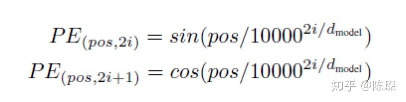
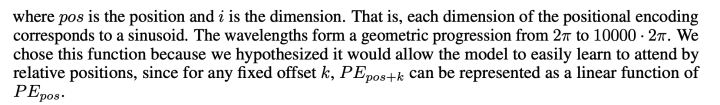
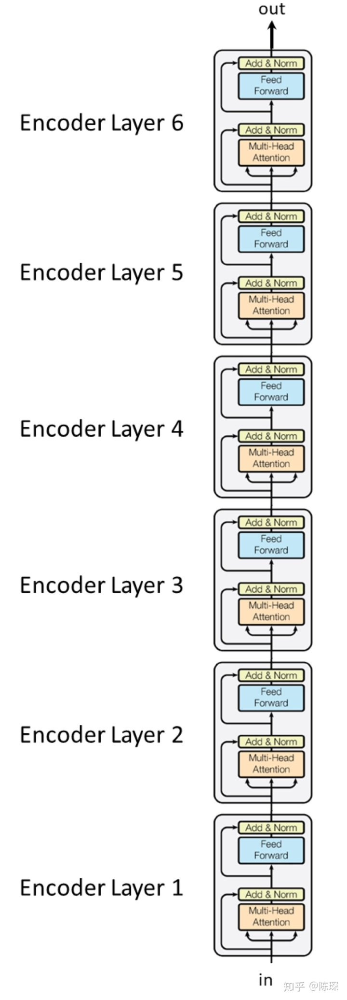
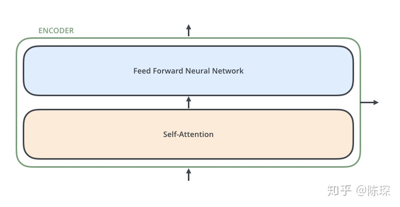
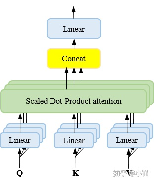
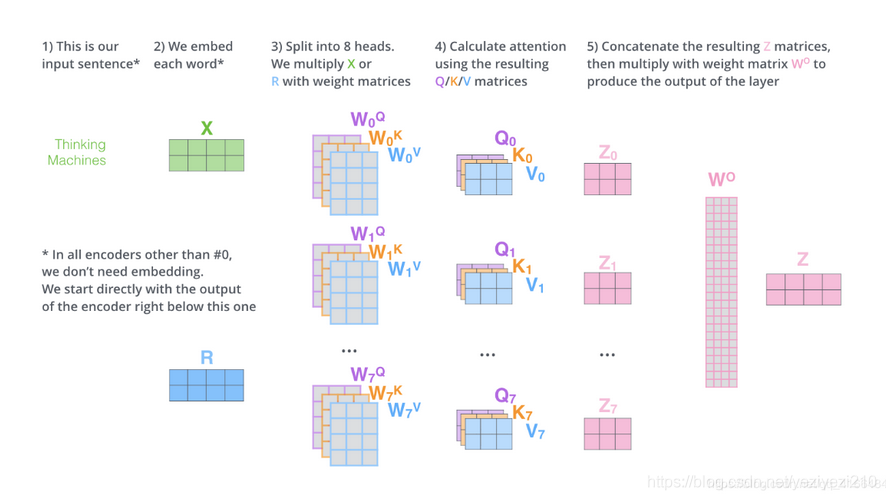
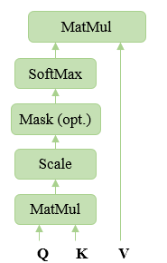
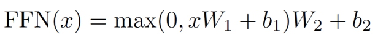
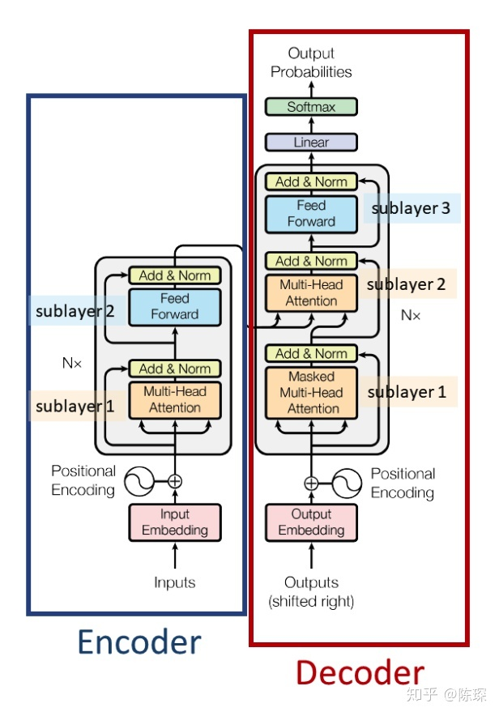
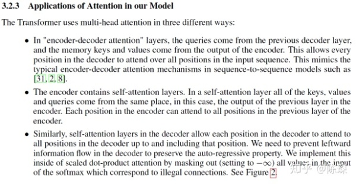

[非常好的文章 把Transoformer讲的很清楚](https://zhuanlan.zhihu.com/p/80986272)
1. 有了rnn，为什么还要有Transformer？
   ```
   rnn不能并行计算
   ```
2. Positional Embedding
   
   </img>  
   </img>
   ```
   优点：学习相对位置
   ```
3. Transformer - Encoder
   
   </img>  </img>
   ```
    多layer串联
    每个layer有两个sub-layer：”multi-head self-attention mechanism“和”simple，position-wise fully connected feed-forward network“
   ```

4. Multi-head Attention流程
   
   </img></img>
   ```
   Transformer的encoder的第一层的输入是embedding，其余层的输入是前一层的输出
   
   1.Query、Key、Value分别通过n次线性变换得到n组Q、K、V，这里n对应着n-head。
   PS: shape由原来的[nbatches, seq_len, d_model]变为了[nbatches, seq_len, num_head, d_k]，其中d_k=d_model/num_head=key的维度
   2.对于每一组Qi、Ki、Vi，通过Attetion（scaled Dot-product Attention）得到相应输出Head_i
   3.拼接所有的Head_0 ~ Head_n，并将其线性映射为最终输出
   PS: shape变回了[nbatches, seq_len, d_model]
   ```

5. self-attention的作用
   ```
   帮助编码器在对每个单词编码时，能够关注输入句子的其他单词。
   ```
6. scaled dot-product Attention流程
   
   </img>
   ```
   Attention(Q,K,V) = softmax((QK^T)/(d_k**0.5))·V
   其中，Q、K的shape为[nbatches, seq_len, d_k] ，V的shape为[nbatches, seq_len, d_v]
   （d_k = d_model / n_head）
   ```

7. Attention的scale的作用
   
   ```
   好文章：https://www.zhihu.com/question/339723385/answer/782509914
   
   缩放：除以 d_k**0.5
   （原因：防止d_k增大时，Q和K的点积值过大，方差变成原来的 d_k 倍，从而使得softmax梯度变得非常小）
   D(q·k/(d_k**0.5)) = d_k/(d_k**0.5)^2 = 1
   将方差控制为1，有效控制了梯度消失问题。
   ```

8. Position-Wise fully connected feed-forward network
   
   </img>

9.  Transformer - decoder
   
   </img>
   ```
   Decoder也是N层堆叠的结构。被分为3个SubLayer，可以看出 Encoder 与 Decoder三大主要的不同：
   Diff_1：Decoder SubLayer-1 使用的是 “masked” Multi-Headed Attention 机制，防止为了模型看到要预测的数据，防止泄露。
   Diff_2：SubLayer-2 是一个 encoder-decoder multi-head attention。
   Diff_3：LinearLayer 和 SoftmaxLayer 作用于 SubLayer-3 的输出后面，来预测对应的 word 的 probabilities 。

   重点在于x=self.sublayer1 self.src_attn是 MultiHeadedAttention的一个实例。
   query=x，key=m, value=m, mask=src_mask，这里x来自上一个DecoderLayer，m来自Encoder的输出。

   最后的 linear layer 将 decoder 的输出扩展到与 vocabulary size 一样的维度上。
   经过 softmax 后，选择概率最高的一个 word 作为预测结果。
   ```
11. Transformer里的三种Attention
   
    </img>
    ```
    1.encoder-decoder Attention
    2.self-attention (in encoder)
    3.masked self-attention (in decoder)
    ```
12. Transformer中的mask是怎么做的？
    ```
   1.Pading Mask（可用于encoder和decoder）：
   使得被PAD为0的位置上的值成为一个非常小的负数(可以是负无穷)，经过softmax之后，这些位置的概率就变为了0.
   由此，相当于把目标位置的无用信息给mask掉了。
   2.Sequence Mask(只用于decoder)：
   使用和原Tensor大小相同的掩码下三角形Tensor，即上三角部分全为非常小的负数(可以是负无穷)，经过softmax之后，这些位置的概率就变为了0。
   由此，相当于把目标位置的无用信息给mask掉了。
    ```
文章：  
```
（已读）
非常好的文章 把Transoformer讲的很清楚 
https://zhuanlan.zhihu.com/p/80986272)
（未读）  
https://zhuanlan.zhihu.com/p/148656446
```