## 词向量
1. Skip-gram和CBOW
    ```
    如果是用一个词语作为输入，来预测它周围的上下文，那这个模型叫做『Skip-gram 模型』
    而如果是拿一个词语的上下文作为输入，来预测这个词语本身，则是 『CBOW 模型』
    ```
    </img>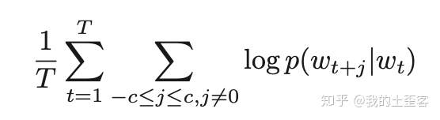</img></img>
2. word2vec本质
   
   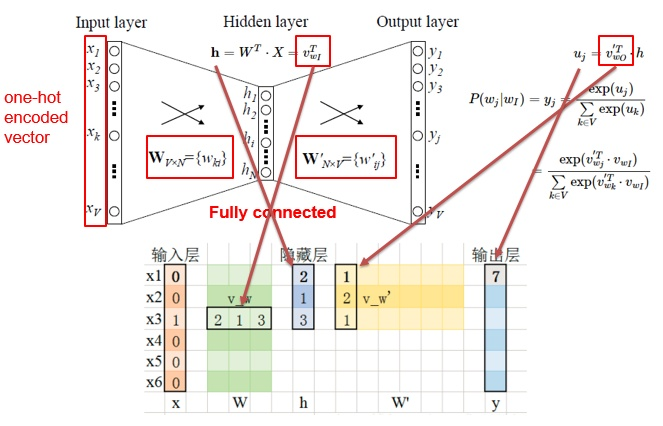</img>
   ```
    当模型训练完后，最后得到的其实是神经网络的权重，比如现在输入一个 x 的 one-hot encoder: [1,0,0,…,0]，对应刚说的那个词语『吴彦祖』，则在输入层到隐含层的权重里，只有对应 1 这个位置的权重被激活，这些权重的个数，跟隐含层节点数是一致的，从而这些权重组成一个向量 vx 来表示x，而因为每个词语的 one-hot encoder 里面 1 的位置是不同的，所以，这个向量 vx 就可以用来唯一表示 x。

    注意：上面这段话说的就是 Word2vec 的精髓！！

    此外，我们刚说了，输出 y 也是用 V 个节点表示的，对应V个词语，所以其实，我们把输出节点置成 [1,0,0,…,0]，它也能表示『吴彦祖』这个单词，但是激活的是隐含层到输出层的权重，这些权重的个数，跟隐含层一样，也可以组成一个向量 vy，跟上面提到的 vx 维度一样，并且可以看做是词语『吴彦祖』的另一种词向量。而这两种词向量 vx 和 vy，正是 Mikolov 在论文里所提到的，『输入向量』和『输出向量』，一般我们用『输入向量』。

    需要提到一点的是，这个词向量的维度（与隐含层节点数一致）一般情况下要远远小于词语总数 V 的大小，所以 Word2vec 本质上是一种降维操作——把词语从 one-hot encoder 形式的表示降维到 Word2vec 形式的表示。
    ```
3. 噪声对比评估方法（NEC）的思想
    ```
    假设X=(x1,x2,⋯,xTd)是从真实的数据（或语料库）中抽取样本，但是样本服从什么样的分布我们不知道，
    那么先假设其中的每个xi服从一个未知的概率密度函数pd。这样我们需要一个相对可参考的分布反过来去估计概率密度函数pd，
    这个可参考的分布或称之为噪音分布应该是我们知道的，比如高斯分布，均匀分布等。假设这个噪音分布的概率密度函数pn，
    从中抽取样本数据为Y=(y1,y2,⋯,yTn)Y=(y1,y2,⋯,yTn)，而这个数据称之为噪声样本，
    我们的目的就是通过学习一个分类器把这两类样本区别开来，并能从模型中学到数据的属性，
    噪音对比估计的思想就是“通过比较而学习”。
    ```

4. word2vec - trick - negative sampling

    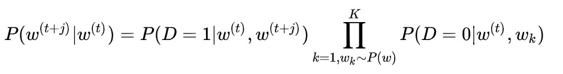</img>
    ```
    本质是预测总体类别的一个子集，生成k个噪声
    优化方向为 基于中心词生成正确的背景词概率为1，生成噪声词概率为0。
    ```
5. 如何选择negative words

    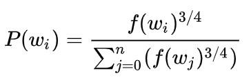</img>

    ```
    一个单词被选作negative sample的概率跟它出现的频次有关，
    出现频次f(w_i)越高的单词越容易被选作negative words。

    负采样的C语言实现非常的有趣。unigram table有一个包含了一亿个元素的数组，这个数组是由词汇表中每个单词的索引号填充的，并且这个数组中有重复，也就是说有些单词会出现多次。那么每个单词的索引在这个数组中出现的次数该如何决定呢，有公式p(w_i)*table_size，也就是说计算出的负采样概率*1亿=单词在表中出现的次数。
    有了这张表以后，每次去我们进行负采样时，只需要在0-1亿范围内生成一个随机数，然后选择表中索引号为这个随机数的那个单词作为我们的negative word即可。一个单词的负采样概率越大，那么它在这个表中出现的次数就越多，它被选中的概率就越大。
    PS: 面试官提醒“可以对空间优化”，用长度为|V|的累加数组(递增)，再用二分查找在数组中找到值等于“负采样概率*1亿=单词在表中出现的次数”的元素的下标对应的元素
    ```

6. 概率取0.75幂次的原因
    ```
    相比于直接使用频次作为权重，取0.75幂的好处可以减弱不同频次差异过大带来的影响，使得小频次的单词被采样的概率变大
    ```

7. word2vec - trick - hierarchical softmax

    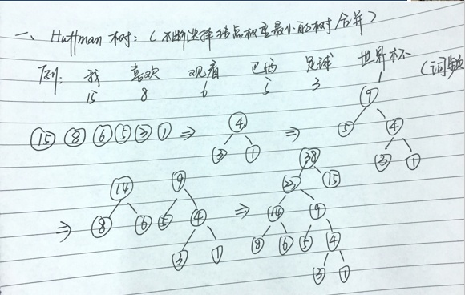</img>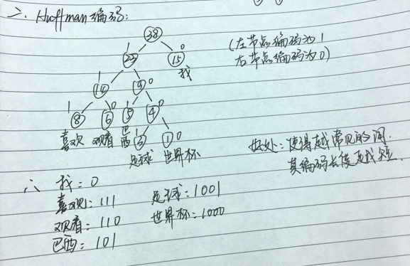</img>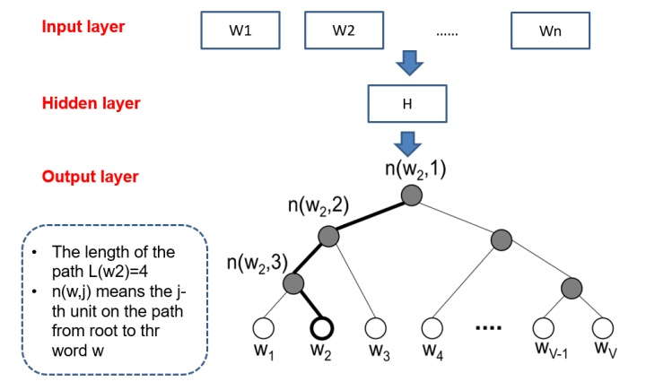</img>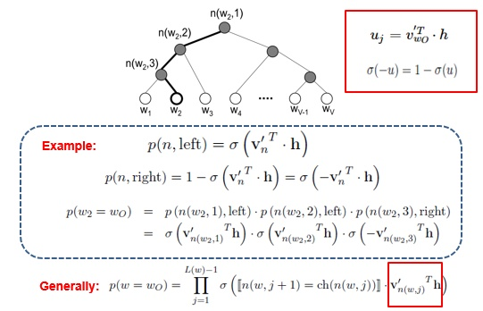</img>
    ```
    本质是采用哈夫曼树把N分类问题变成log(N)次二分类
    
    只用计算树深度个输出节点的概率就可以得到目标单词的概率，只更新路径长度个参数。
    高频词非常接近树根，其所需要的计算次数将进一步减少，这也是使用哈夫曼树的一个优点。
    ```
8. Word2vec,fasttext,ELMo,GPT,BERT的区别
    ```
    1.Word2vec, Fasttext, Glove是静态词向量；ELMo, GPT, BERT是动态词向量
    2.ELMo等可以解决一词多义、未登录词问题。
    3.word2vec仅仅考虑了两个词在一段上下文的相关度，而GloVe考虑了两个词向量在全文中的相关度。
    4.Glove全局语料库，共现矩阵，滑窗，V*V稀疏and维度高-->SVD或PCA降维but计算量大
    5.word2vec、fasttext局部语料特征，
    6.fastText训练词向量时会考虑subword；还可以进行有监督学习进行文本分类；引入N-gram，考虑词序特征；
    7.glove可以被看作是更换了目标函数(交叉熵-->MSE)和权重函数(固定-->映射变换)的全局word2vec
    ```
9. elmo、GPT、bert三者之间有什么区别？
    ```
    1.elmo采用LSTM进行提取，GPT和bert则采用Transformer进行提取
    2.GPT采用单向语言模型，elmo和bert采用双向语言模型。但是elmo实际上是两个单向语言模型（方向相反）的拼接，这种融合特征的能力比bert一体化融合特征方式弱
10. Bert的参数
    ```
    a
    ```
11. Bert是怎么用Transformer的？
    ```
    
## 概率图模型
1. CRF
    ```
    CRF是无向判别图
    CRF试图对多个变量在给定观测值后的条件概率进行建模，作为约束来控制输出的合理性。
    马尔可夫随机场有一组势函数，非负实函数，定义该团上的概率分布函数

    1.计算损失函数
    2.输出标签最优路的找法（条件概率最大的标记序列）（维特比）
    ```
2. CRF的损失函数

    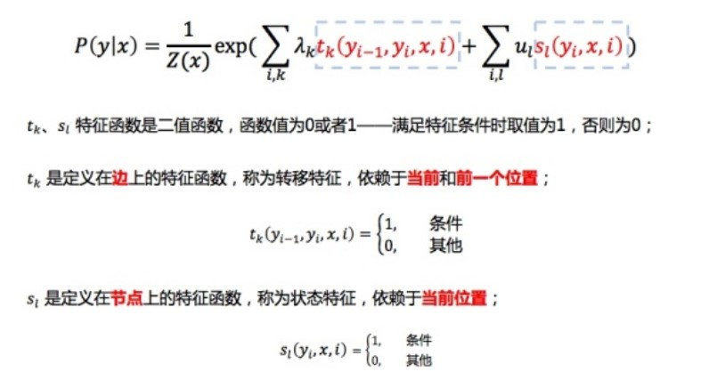

    ```
    E = P_realpath / P_total
    其中，P_realpath = e^S_i，i是第i条路径的分值
    其中，score如上图所示
    ```

3. CRF的标签最优路的找法
    ```
    维特比算法：
    score[i][j] = max(score[i-1][k] + trans[k][j] + emission[i][j]) for every k
    其中，i是第i个元素、j是第j个标签、trans是trans矩阵、emission是lstm的输出
    ```

4. HMM
    ```
    HMM是有向生成图
    ```

5. HMM的三个基本问题

6. HMM的三个马尔可夫性
    ```
    1.全局马尔可夫性
    2.局部马尔可夫性
    3.成对马尔可夫性
    ```
7. LDA
    ```
    LDA是生成式概率图模型
    LDA利用文档中单词的共现关系来对单词按主题聚类，
    也可以理解为对“文档-单词”矩阵进行分解，得到“文档-主题”和“主题-单词”两个概率分布。
    ```

## RNN
1. RNN介绍？

    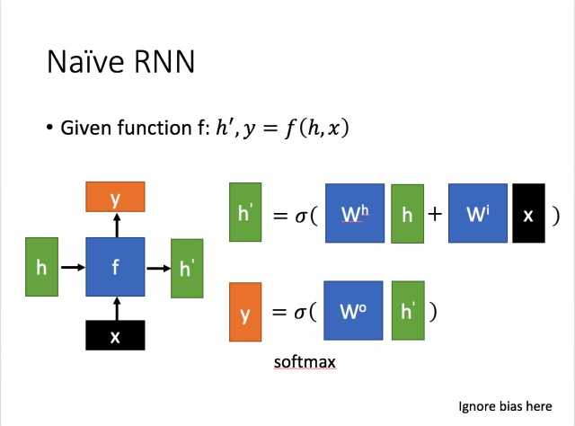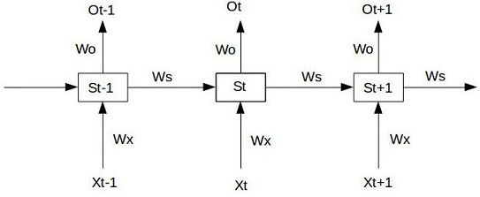
    ```

    ```
2. LSTM和RNN比较
    ```
    1.记忆单元缓解了长序列遗忘问题
    2.门机制缓解了梯度问题
    ```
2. 为什么seq2seq要使用Attention和bi-LSTM？
    ```
    解决的问题：
    1.编码时，输入序列的全部信息压缩到了一个向量表示中，句子越前面的信息丢失越严重
    2.解码时，当前词及对应输入序列词的上下文信息和位置信息丢失
    3.只使用一个方向的循环神经网络计算隐状态，编码器的输出h_i只包含x_0到x_i的信息，相当于在算attention_ij时丢失了x_i后面的词的信息。
    ```
3. seq2seq的loss是什么
    ```
    TODO:
    ```